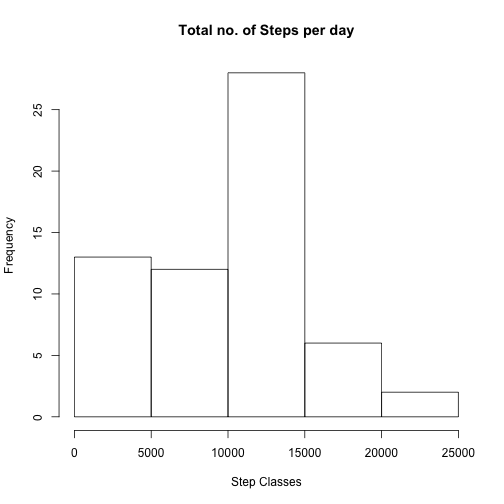
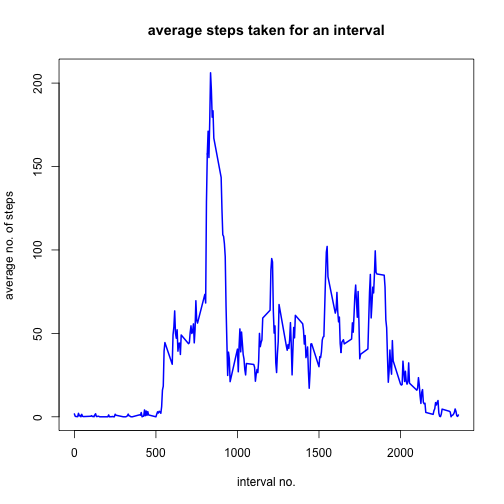
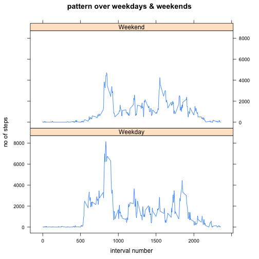

### This document gives a step by step description of the process of computation of the desired results.

##loading and preprocessing the data

Load .csv file in R object "act" (dataframe)


```r
library(lattice)
act <- read.csv(file = "data_activity/activity.csv")
```
## Calculate total number of steps taken per day - Mean & median of this data
1. Calculate total number of steps covered each of the 61 days and plot histogram 
2. Calculate the mean
3. Calculate the median


```r
tot_steps <- tapply(act$steps,as.factor(act$date),sum, na.rm= T)
hist(tot_steps,main = "Total no. of Steps per day", xlab = "Step Classes", ylab = "Frequency")
```



```r
mean(tot_steps)
```

```
## [1] 9354.23
```

```r
median(tot_steps)
```

```
## [1] 10395
```
## Show average pattern across different intervals
1. Calculate average number of steps taken, averaged across all days for a particular 5-minute interval and make time-series plot
2. Calculate interval for which value is maximum and display value


```r
avg_steps <- tapply(act$steps, INDEX = as.factor(act$interval),mean, na.rm =T)
plot(x = names(avg_steps),y = avg_steps,main = "average steps taken for an interval", xlab = "interval no.", ylab = "average no. of steps", type= "l", pch = 3, lwd = 2,col ="blue")
```



```r
index = which(avg_steps == max(avg_steps))
index
```

```
## 835 
## 104
```

```r
max(avg_steps)
```

```
## [1] 206.1698
```

```r
avg_steps[index]
```

```
##      835 
## 206.1698
```
## Imput missing values
1. Create a new data vector for 17568 value replacing NA values with average value for that 5-minute interval and combine this vector to a new dataset with other two column values same as original dataset
2. Calculate and plot the histogram of total numer of steps per day for new dataset. Plot the other histogram with old dataset simultaneously. For seeing the effect on the values after imputation.
3. Calculate mean and median of total number of steps per day using new dataset.


```r
new_steps <- vector(length = nrow(act))
for (i in 1:nrow(act))
{
     if (is.na(act[i,1]))
     {
         new_steps[i] <- avg_steps[as.character(act[i,3])]
     }
     else new_steps[i] <- act[i,1]
 }
new_act <- data.frame(steps = new_steps, date = act$date, interval = act$interval)
ntot_steps <- tapply(new_act$steps,as.factor(new_act$date),sum, na.rm= T)
par(mfrow= c(2,1))
hist(tot_steps,main = "Total no. of Steps per day(with NA)", xlab = "old Step Classes", ylab = "Frequency")
hist(ntot_steps,main = "Total no. of Steps per day(w/o NA)", xlab = "new Step Classes", ylab = "Frequency")
```


```r
mean(ntot_steps)
```

```
## [1] 10766.19
```

```r
median(ntot_steps)
```

```
## [1] 10766.19
```

## Show the pattern for the averages calulated across the five-minute intervals differentiated for weekdays and weekends
Create a new column in new dataset indicating type of day - weekday or weekend (factor type values) and plot pattern shown according to this new factor variable.


```r
Day <- weekdays(as.Date(new_act$date))
new_act <- cbind(new_act,Day)
Day_type <- vector(mode= "character",length = nrow(new_act))
for(i in 1:nrow(new_act))
{
   if(as.character(new_act[i,4])== "Monday"|as.character(new_act[i, 4])=="Tuesday"|as.character(new_act[i,4])=="Wednesday"|as.character(new_act[i,4])=="Thrusday"|as.character(new_act[i,4])=="Friday")
   { 
   	   Day_type[i] <- "Weekday"
   	}
   else Day_type[i] <- "Weekend"
}
Day_type <- as.factor(Day_type)
new_act <- cbind(new_act,Day_type)
xyplot(steps ~ interval| Day_type, data = aggregate(steps ~ Day_type + interval, data = new_act, sum), type= "l",ylab = "no of steps", xlab ="interval number", main ="pattern over weekdays & weekends",layout = c(1,2))
```



